  

  <svg width="400" height="60" viewBox="0 0 400 60" xmlns="http://www.w3.org/2000/svg">
    <defs>
      <linearGradient id="grad" x1="0%" y1="0%" x2="100%" y2="0%">
        <stop offset="0%" stop-color="#ff6b6b">
          <animate attributeName="stop-color" values="#ff6b6b;#4ecdc4;#45b7d1;#ff6b6b" dur="4s" repeatCount="indefinite"/>
        </stop>
        <stop offset="100%" stop-color="#4ecdc4">
          <animate attributeName="stop-color" values="#4ecdc4;#45b7d1;#ff6b6b;#4ecdc4" dur="4s" repeatCount="indefinite"/>
        </stop>
      </linearGradient>
    </defs>
    <text x="200" y="40" text-anchor="middle" fill="url(#grad)" font-size="24" font-family="monospace" font-weight="bold">
      build . ship . repeat
      <animate attributeName="opacity" values="0.6;1;0.6" dur="2s" repeatCount="indefinite"/>
    </text>
  </svg>

---

  
  
  

  

---

### 💡 About

Building things that matter. Passionate about clean code, great UX, and turning ideas into reality.

---

### 🛠️ Tech Stack

  
  
   
  
  
  
   
  
  
  

---

### 📈 GitHub Stats

  

---

### 🧠 Currently

  
  
  

---

  
  
  

  

